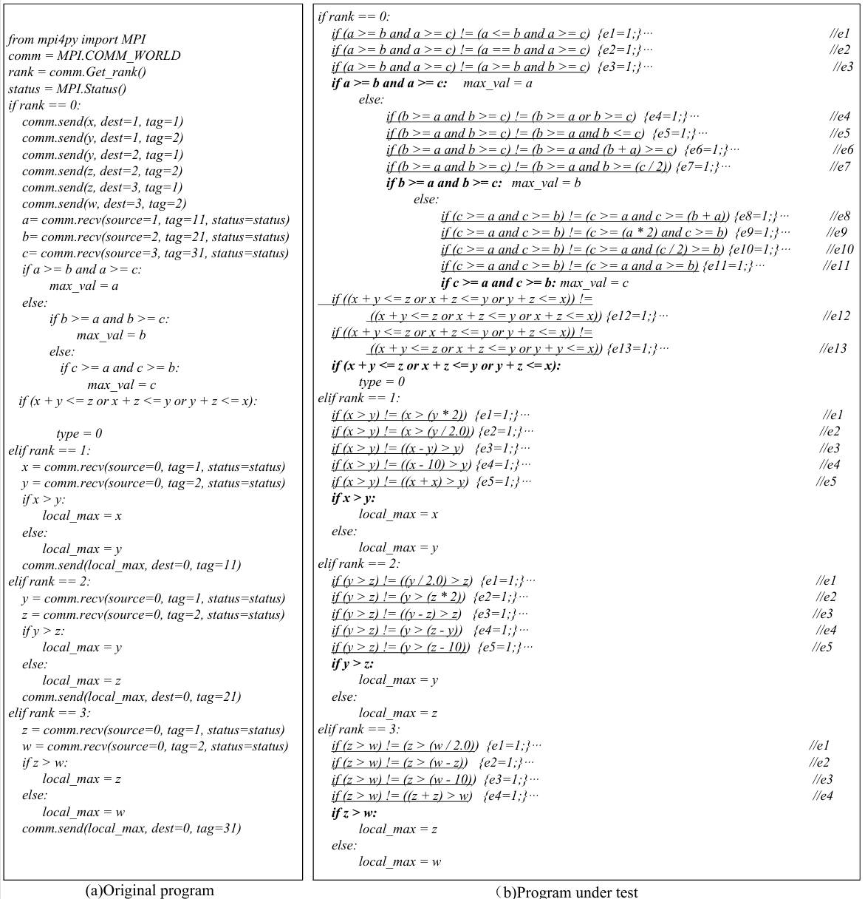
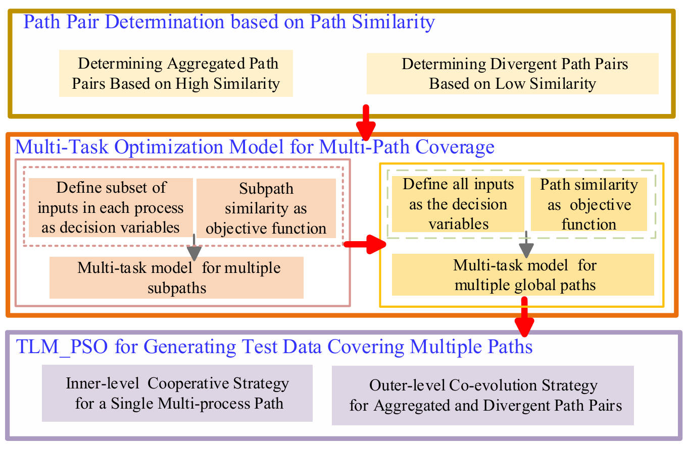
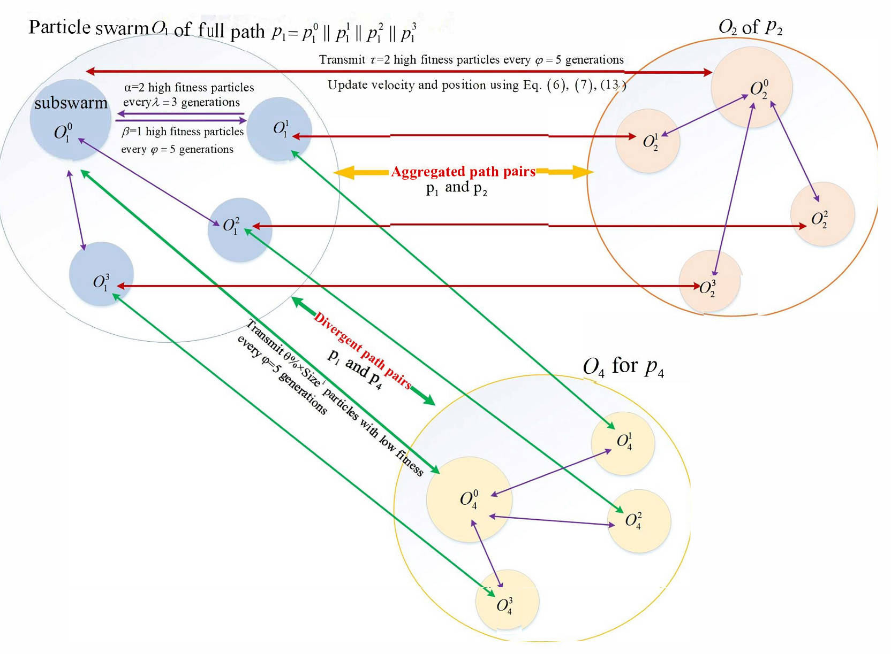

# Two-Layer Co-Evolutionary Multi-Population PSO for Multiple Path Coverage in MPI Program Mutation Testing

This repository provides the implementation and replication materials for the paper **“Two-Layer Co-Evolutionary Multi-Population PSO for Multiple Path Coverage in MPI Program Mutation Testing.”**

The project implements a mutation test data generation method for multiple mutation-based path coverage in MPI programs. It combines inner-level cooperative optimization among particle swarms associated with different process subpaths with outer-level cooperative evolution among particle swarms associated with different target paths. The proposed **Two-Layer Co-Evolutionary Multi-Population Particle Swarm Optimization algorithm (TLM_PSO)** reduces redundant searches in the multi-process input space and reuses useful search information among aggregated and divergent path pairs to improve test data generation efficiency.
## 1. Environment

### 1.1 Hardware

The experiments reported in the paper were conducted using the following hardware environment:

- **Operating system:** Windows 10, 64-bit
- **CPU:** Intel Core i7 processor
- **Memory:** 16 GB RAM

### 1.2 Software

- **Python:** 3.12.4 or later
- **Python environment:** Anaconda base environment
- **mpi4py:** 4.0.3 or later
- **openpyxl:** 3.1.2 or later

Install the required Python packages using:

```bash
pip install -r requirements.txt
```

## 2. Core Experimental Settings

The following settings are used in the implemented experiments.

### 2.1 Input Space and Process Decomposition

Each candidate test input is represented as a five-dimensional vector:

`X = (x, y, z, w, m)`

For Program P1, the input ranges are:

- **x:** `[10, 100]`
- **y:** `[40, 100]`
- **z:** `[30, 300]`
- **w:** `[20, 100]`
- **m:** `[1, 10]`

The process-relevant variable subsets are:

- **Main process:** `(x, y, z, w, m)`
- **Subprocess 1:** `(x, y, z)`
- **Subprocess 2:** `(y, z, w)`
- **Subprocess 3:** `(z, w, m)`

### 2.2 Subprocess Swarm Parameters

- **Number of subprocess swarms:** 3
- **Particle dimension:** 3
- **Swarm size:** 5
- **Inertia weight:** `w = 0.729`
- **Acceleration coefficients:** `c1 = 2.0`, `c2 = 2.0`
- **Velocity range:** `[-100, 100]`
- **Local evolution interval:** `GENL = 3`
- **Information-exchange frequency:** every 3 updates
- **Particle-migration ratio:** 30%

### 2.3 Cooperative Swarm Parameters

- **Particle dimension:** 5
- **Swarm size:** 26
- **Inertia weight:** `w = 0.729`
- **Acceleration coefficients:** `c1 = 2.0`, `c2 = 2.0`
- **Velocity range:** `[-100, 100]`
- **Global evolution interval:** `GENO = 5`
- **Information-exchange frequency:** every 5 updates
- **Particle-migration ratio:** 30%
- **Number of feedback particles:** `H = 2`

### 2.4 Outer-Level Information Exchange

- **Aggregated path pairs:** exchange high-fitness particles.
- **Divergent path pairs:** migrate low-fitness particles.
- **Received particles:** re-evaluated using the receiving target path.

## 3. Framework Overview

The following figures illustrate the construction of the program under test, the overall workflow of the proposed method, and the two-layer co-evolutionary mechanism.

### 3.1 Construction of the Program Under Test

<p align="center">
  
</p>

<p align="center">
  <em>Figure 1. Original MPI program and the corresponding program under test after inserting mutant branches.</em>
</p>

### 3.2 Overall Framework of TLM_PSO

<p align="center">
  
</p>

<p align="center">
  <em>Figure 2. Overall framework of the proposed Two-Layer Co-Evolutionary Multi-Population Particle Swarm Optimization algorithm (TLM_PSO).</em>
</p>

### 3.3 Two-Layer Co-Evolutionary Mechanism

<p align="center">
  
</p>

<p align="center">
  <em>Figure 3. Two-Level Multi-Population PSO (TLM-PSO) for Co-Evolution.</em>
</p>

## 4. Core Modules


- **Path-pair determination:** Target paths are paired according to path similarity, forming aggregated path pairs with high similarity and divergent path pairs with low similarity.

- **Process-relevant variable decomposition:** The complete input vector is decomposed into variable subsets according to the variables affecting each process subpath.

- **Inner-level cooperative optimization:** Subprocess swarms search the process-relevant variable subsets, while the cooperative swarm combines and evaluates the partial solutions in the complete input space.

- **Outer-level co-evolution:**
  - **Aggregated path pairs:** High-fitness particles are exchanged to reuse useful search information and accelerate convergence.
  - **Divergent path pairs:** Low-fitness particles are migrated to introduce heterogeneous information and improve population diversity.

- **Multi-path test data generation:** The inner- and outer-level strategies are coordinated to generate test data covering multiple target mutation-based paths.
  
## 5. Algorithms

### Algorithm 1: Two-Level Co-Evolutionary Multi-Population PSO for Test Data Generation

```text
Input:
    Full paths set P = {p_1, p_2, ..., p_n} for a parallel
    program P; Parameters

Output:
    Test data set for each full path p_k, covering all its
    subpaths p_k^0 to p_k^(m-1)

1:  Initialize particle swarms O_k and O_k^i ∈ O_k with
    the input variables of process G^i
2:  while the termination condition for test data generation
    is not met do
3:      for iter = 1 to maximum iterations do
4:          for each particle x_(k,j)^i in O_k^i do
5:              Evaluate the fitness of x_(k,j)^i on
                subpath p_k^i
6:              PSO performs evolutionary operations
7:          end for
8:          for each full-path task T_k do
9:              if the inner-level evolution condition is met then
10:                 Call Algorithm 2 to exchange information
                    among the inner-level swarms O_k^0 to
                    O_k^(m-1)
11:             end if
12:             Evaluate the fitness of the full path for T_k
13:             Update gbest_k if the current global fitness
                is better
14:         end for
15:         if the outer-level evolution condition is met then
16:             Call Algorithm 3 to perform information transfer
                between aggregated/divergent path pairs and
                update the elite sets
17:         end if
18:     end for
19: end while
20: return the test data set for all full paths
```

### Algorithm 2: Inner-Level Cooperative PSO for a Single Multi-Process Path

```text
Input:
    A full path
    p_k = p_k^0 || p_k^1 || ... || p_k^(m-1);
    Parameters

Output:
    Test data covering p_k

1:  Evolve each O_k^i in parallel within its respective process
2:  Pause evolution if a message-passing statement waits for
    information from other processes
3:  while the termination condition is not met do
4:      for each sub-swarm O_k^i
        (i = 1, 2, ..., m - 1) do
5:          if evolution reaches λ generations then
6:              Select α high-fitness particles
                x_(k,h)^i, h = 1, 2, ..., α
7:              Transmit these particles to the cooperative
                swarm O_k^0
8:              Pause the evolution of O_k^i and wait for
                messages from O_k^0
9:          end if
10:     end for
11:     Evolve O_k^0 with the combined particles
12:     if the test data cover p_k or the maximum number of
        iterations is reached then
13:         Terminate all swarms
            O_k^0, O_k^1, ..., O_k^(m-1)
14:         Go to Line 27
15:     end if
16:     if the evolution of O_k^0 reaches φ iterations then
17:         Select β high-fitness particles
            x_(k,h)^0, h = 1, 2, ..., β
18:         Transmit these particles to the respective
            sub-swarms O_k^i according to their variable
            requirements
19:         Pause the evolution of O_k^0 and wait for messages
            from the sub-swarms
20:     end if
21:     for each sub-swarm O_k^i
        (i = 1, 2, ..., m - 1) do
22:         Receive new particles from O_k^0
23:         Randomly replace particles in swarm O_k^i with
            the received particles
24:         Resume the evolution of O_k^i
25:     end for
26: end while
27: return the test data covering the full path p_k
```

### Algorithm 3: Outer-Level Co-Evolutionary PSO Strategy for Aggregated and Divergent Path Pairs

```text
Input:
    Set of full paths p = {p_1, p_2, ..., p_L},
    where p_k = p_k^0 || p_k^1 || ... || p_k^(m-1);
    Parameters

Output:
    Test data set covering all full paths

1:  For each aggregated pair <p_a, p_b> or divergent pair
    <p_a, p_c>, establish cooperative relationships
2:  Initialize the elite particle sets H_a^i = ∅ for all O_a^i
3:  while the termination condition is not met do
4:      for each aggregated path pair do
5:          for each path p_b in the aggregated pair
            <p_a, p_b> and each sub-swarm O_b^i do
6:              if evolution reaches λ iterations then
7:                  Select τ high-fitness particles from O_b^i
                    and transmit them to the corresponding O_a^i
8:                  Update H_a^i with the received particles,
                    retaining the top τ fitness values
9:              end if
10:         end for
11:         for each particle in O_a^i at generation g do
12:             Current position: X^i(g);
                velocity: V^i(g)
13:             Personal best: Pb_a(g);
                global best: Gb_a(g)
14:         end for
15:         Obtain the decision parameter k_tp using Eq. (12)
16:         Generate a random value rand ∈ [0, 1]
17:         if rand > k_tp then
18:             Update velocity using traditional PSO according
                to Eq. (6)
19:         else
20:             Select a cooperative particle C_b^b(g*) from H_a^i
21:             Update velocity with cooperative information
                according to Eq. (13)
22:         end if
23:         Update the particle position according to Eq. (7)
24:     end for
25:     for each divergent path pair do
26:         for the cooperative swarm O_a^0 of path p_a in the
            divergent pair <p_a, p_c> do
27:             if evolution reaches φ generations then
28:                 Sort all particles in O_a^0 in ascending order
                    according to their fitness values
29:                 Select θ% × Size^i particles with low
                    fitness values
30:                 Transmit these low-fitness particles
                    Low_(a,j)^0 to the cooperative swarm O_c^0
                    of path p_c
31:             end if
32:             Calculate the new fitness values of particles
                Low_(a,j)^0
                (j = 1, 2, ..., θ% × Size^i)
                using the objective function of p_c
33:             if the new fitness of Low_(a,j)^0 is better than
                that of some particle x_(c,j)^0 in O_c^0 then
34:                 Replace the original particle x_(c,j)^0
                    with Low_(a,j)^0
35:             end if
36:         end for
37:     end for
38:     Check the termination condition:
        all paths are covered or the maximum number of
        iterations is reached
39: end while
40: return the test data set for all target paths
```
## 6. Quick Start

The repository contains the TLM_PSO implementations for six MPI benchmark programs. Each experimental script performs 25 executions, including 5 warm-up executions and 20 formal independent runs, and automatically exports the statistical results.

### 6.1 Clone the Repository

```bash
git clone https://github.com/Gao12024952/TLM-PSO-MPI.git
cd TLM-PSO-MPI
```

### 6.2 Install Dependencies

Install the required Python packages using:

```bash
pip install -r requirements.txt
```

An MPI runtime must also be installed before executing the programs. The MPI environment can be checked using:

```bash
mpiexec --version
```

### 6.3 Run an Experiment

For example, run the RQ1 experiment for Program P1 using:

```bash
mpiexec -n 4 python "experiments/P1_tests/test_unit_1/RQ1/TLM_PSO.py"
```

The number of MPI processes is determined by:

Number of MPI processes = Number of target paths × 4

Each target path is assigned four MPI processes, including one main process and three subprocesses. Therefore, when one target path is executed, -n 4 should be used. When multiple target paths are executed concurrently, the value following -n should be adjusted according to the total number of target paths.

### 6.5 Experimental Results

The experimental results are automatically saved in the `experimental_results/` directory. The generated files include:

- `success.xlsx`: path-coverage success results
- `time.xlsx`: total execution time
- `iterations.xlsx`: number of iterations
- `evaluations.xlsx`: number of fitness evaluations

The first five executions are treated as warm-up runs and are excluded from the final statistical results.

## 7. Repository Structure

```text
TLM-PSO-MPI/
├── Picture/
│   ├── figure1.jpg
│   ├── figure2.jpg
│   └── figure3.jpg
│
├── experiments/
│   ├── P1_tests/
│   │   └── test_unit_1/
│   │       └── RQ1/
│   │           └── TLM_PSO.py
│   │           └── IC_PSO.py
│   │           └── PSO.py
│   │       └── RQ2/
│   │       └── RQ3/
│   │       └── unit.txt
│   ├── P2_tests/
│   ├── P3_tests/
│   ├── P4_tests/
│   ├── P5_tests/
│   └── P6_tests/
│
├── subjects/
│   ├── P1_Intelligent_Learning_Platform/
│           └── P1_Intelligent_Learning_Platform.py
│   ├── P2_Industrial_Production_Line_Analysis/
│   ├── P3_Business_Intelligence_Analysis/
│   ├── P4_Urban_Operations_Monitoring/
│   ├── P5_Scientific_and_Engineering_Computing/
│   └── P6_UAV_System_Monitoring/
│
├── .gitignore
├── LICENSE
├── README.md
└── requirements.txt
```
## 8. Comparative Experiments

The `experiments/` directory contains the scripts used for the baseline comparisons and ablation studies corresponding to RQ1–RQ3. The scripts are organized according to the benchmark program, test unit, and research question.

| Research Question | Script | Purpose |
|---|---|---|
| RQ1–RQ3 | `TLM_PSO.py` | Implements the complete TLM_PSO method, including the inner-level cooperative PSO, the outer-level co-evolutionary PSO, similarity-based path pairing, differentiated strategies for aggregated and divergent path pairs, and the information-transfer decision parameter `k_tp`. |
| RQ1 | `PSO.py` | Uses traditional PSO without inner-level or outer-level cooperative evolution and serves as the basic comparison method. |
| RQ1 | `IC_PSO.py` | Retains only the inner-level cooperative PSO for a single multi-process path and removes outer-level cooperation among different target paths. It is used to evaluate the independent contribution of IC_PSO. |
| RQ2 | `TLM_PSO-ra.py` | Randomly constructs path pairs and uniformly applies the aggregated-path-pair cooperative strategy to all path pairs. The `k_tp` parameter is removed, and information exchange is performed in every generation. |
| RQ2 | `TLM_PSO-rd.py` | Randomly constructs path pairs and uniformly applies the divergent-path-pair cooperative strategy to all path pairs. It evaluates the importance of similarity- and divergence-guided path pairing. |
| RQ3 | `TLM_PSO-sa.py` | Retains similarity-based path pairing and the aggregated-path-pair cooperative strategy, while removing the divergent-path-pair cooperative strategy. It evaluates the contribution of information sharing among similar paths to convergence acceleration. |
| RQ3 | `TLM_PSO-noKtp.py` | Removes the information-transfer decision parameter `k_tp` while retaining the other components of TLM_PSO. Cooperative information is therefore adopted without dynamic decision control, allowing the effect of `k_tp` on stability and convergence to be evaluated. |
| RQ3 | `TLM_PSO-sd.py` | Retains similarity-based path pairing and the divergent-path-pair cooperative strategy, while removing the aggregated-path-pair cooperative strategy. It evaluates the contribution of heterogeneous particle migration to population diversity and global search ability. |

## 9. License

This project is licensed under the MIT License. See [LICENSE](LICENSE) for details.

## 10. Acknowledgments and Provenance of Experiment Subjects

The six experiment subjects (P1–P6) used in this replication package were independently developed for the experimental evaluation. Their application scenarios, representative variables, and system decomposition were inspired by related publications and open-source software frameworks. We express our sincere gratitude to the original authors and development teams for their contributions. The detailed provenance is as follows:

- **P1 :** Inspired by the Open University Learning Analytics Dataset (OULAD) proposed by Kuzilek et al. [35]. The learning-analytics scenario and representative indicators, including learning progress, knowledge mastery, study duration, and platform interaction, were used as references when constructing this MPI subject program.

- **P2 :** Inspired by the MPI program-under-test organization and mutation-based path-coverage scenario presented by Dang et al. [21]. The subject was independently developed to represent production-speed, quality, energy-consumption, personnel-efficiency, and equipment-condition analysis in an industrial production-line environment.

- **P3 :** Inspired by the business-intelligence framework described by Negash [36]. The subject integrates customer relationship management, financial-risk assessment, market-competitiveness analysis, supply-chain optimization, and human-resource management into a multi-process business-analysis scenario.

- **P4 :** Inspired by the CityPulse large-scale data analytics framework for smart cities proposed by Puiu et al. [37]. The subject combines traffic-flow monitoring, environmental-quality analysis, energy-consumption assessment, public-safety evaluation, logistics-distribution analysis, and population-mobility monitoring.

- **P5 :** Developed according to the mini-application concept described by Doerfler et al. [38]. The subject provides simplified MPI-based computational scenarios involving fluid dynamics, heat transfer, quantum mechanics, molecular dynamics, celestial mechanics, and material-stress analysis.

- **P6 :** Inspired by the modular PX4 robotics framework proposed by Meier et al. [39]. The subject integrates flight control, battery-energy management, navigation and positioning, visual acquisition, obstacle avoidance, communication transmission, mission-payload monitoring, and environmental adaptation.

The source code of P1–P6 was independently implemented for this replication package and was not directly copied from the cited publications or open-source projects. The references mainly provided inspiration for the application scenarios, system decomposition, and representative input variables.


